# "Virtual Teacher" Application

[Click to join "Virtual Teacher"](link)

## Description

Virtual Teacher is an online platform designed to educate children by providing a dynamic learning environment. Our platform empowers teachers to deliver engaging courses, lectures, and assignments, while also grading the students and recieving feedback for their work.

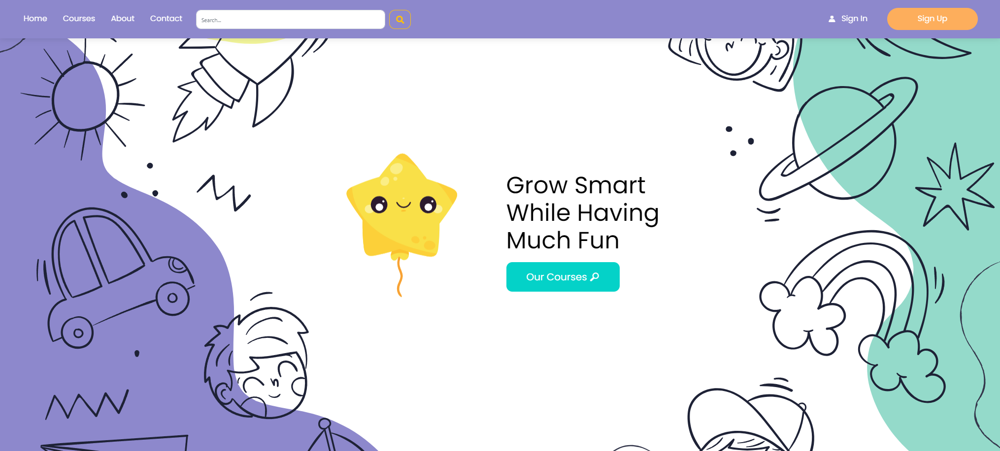

## Getting started

To use “Virtual Teacher”, you may enter either as guest user or as registered. As a guest user you will have access to browse available courses and their lectures. As a registered user you will be assigned the role of a student with the option to enroll in courses, study lectures, watch the presented videos and get assignments. You can also send request to apply for the position of “Teacher”, having the rights to create courses, lectures, embed videos and give assignments. Additionally, it offers a seamless integration with Wikipedia, allowing users to search for information without leaving the application. 

## Functionality

- Use the “Sign Up” menu to setup your user account. User name and password are mandatory. Mail address is also mandatory as it will be used by the application to send you conformation emails, authentication and to communicate with you.

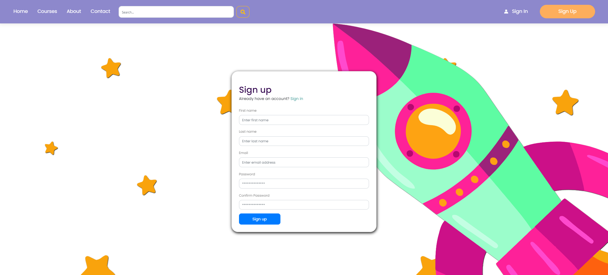

- Once registered, you will receive conformation email and you can immediately log into the application. Use the “Sign In” menu to do so.

- When already inside the application, you can proceed with further amendment of your profile. You can use “Profile” menu to:
  - Change and update your User name and Password.
  - Upload a profile picture or update an existing one.

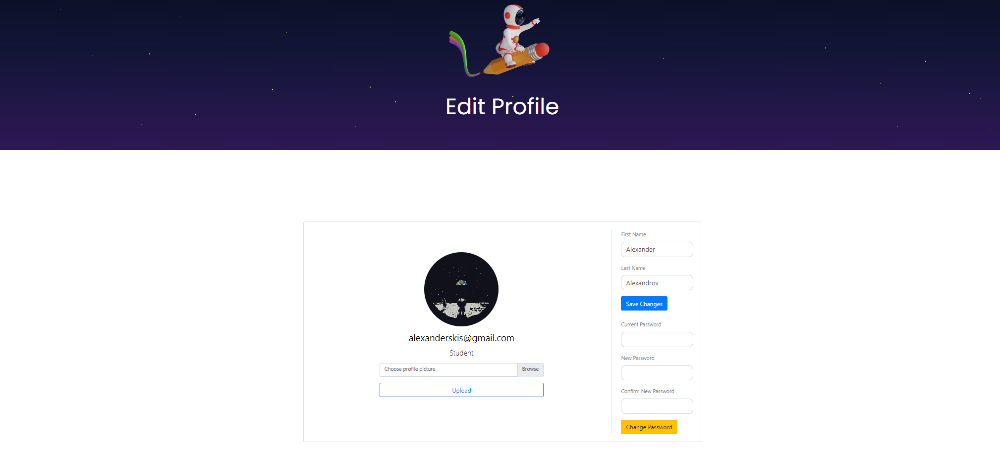

- A user can browse courses by using the “Course” menu on the navigation bar or use the “Our Courses” button in the Home page.
- Users can navigate to different categories/topics such as “Space Exploration”, “Art and Creativity”,”Music and Movement” and others, which contain different courses.
- Each course contains a description, list of lectures, teacher information and a space for you to leave a rating and write feedback.

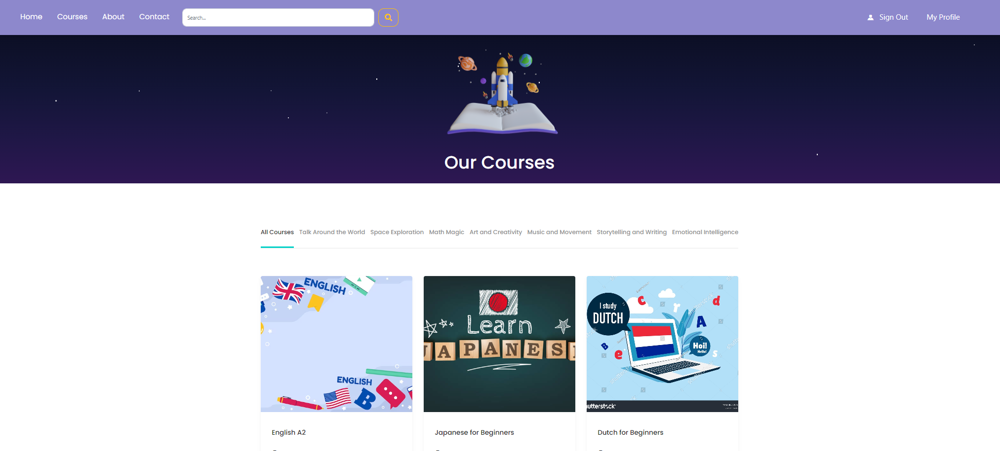

- Pick a course and use the “Enroll” menu to gain full access to the contents of the lectures. 

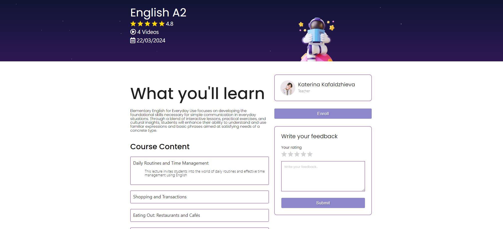

- Once enrolled in a course, navigate to a lecture and you will be able to read the assignments, watch the embedded videos as well as upload your own completed assignments on which you will be graded by the teacher.

- Users can use the “Search” option in the navigation bar to look up information from Wikipedia directly from the application. This will open a new page with the search results with a snippet and a link to the original article.

LECTURES WITH EMBEDDED VIDEOS AND ASSIGNMENTS SCREENSHOT

## Teachers
- In “Virtual Teacher” users can also apply for the role of “Teacher” by navigating to the Home page and scrolling down to use “Start Teaching Today” menu. 

- Once in the “Become a teacher” menu, the user must enter an email, a name and write a message to submit their application. A verification email will be sent to the applicant with the contents of their application and a conformation link. The applicant must click the link in order for the application to be submitted to the official email of the platform, where an administrator will decide whether to approve it or not. If approved the administrator registers the applicant’s email to the database and after registration the “Teacher” role will be assigned to the user.

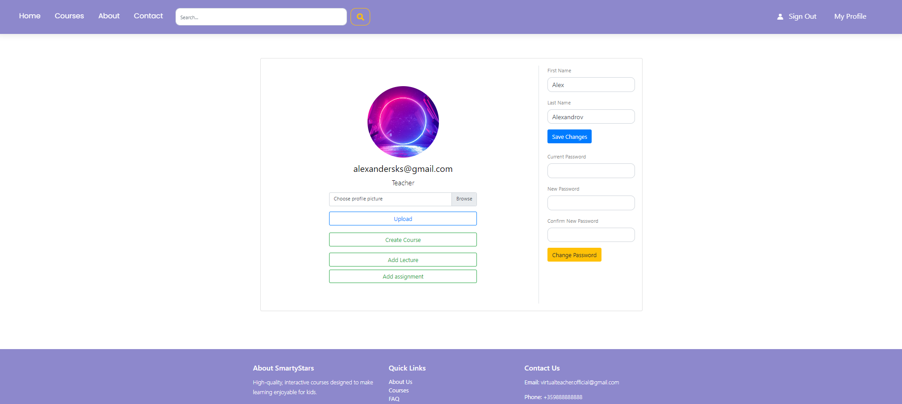

- If approved, the teacher can now create courses, drafts of courses, write lectures, embed videos and upload assignments.

## Course Creation
- To create a Course navigate to the “Profile” menu. In the “Profile” menu open “Create Course” menu. The teacher must enter a title for the Course, pick a predetermined Topic, enter a Description, a Start Date and a Photo for the course. The course will then be created and shown in the respective topic category.

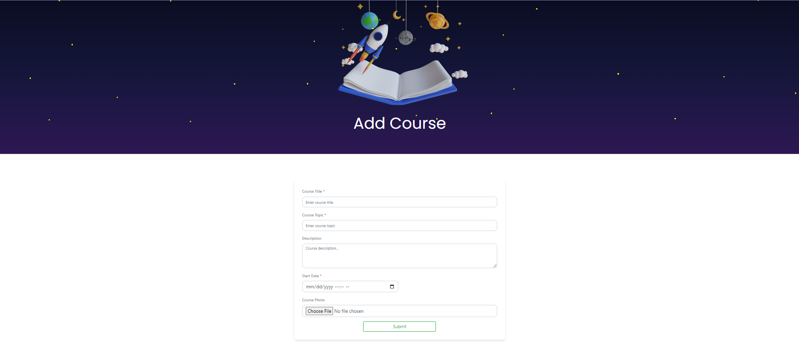

- To create a Lecture navigate to the “Profile” menu where you need to open the “Add Lecture” menu. The teacher must then add a Title, a Description, a Video URL and pick a Course from the drop down menu for the Lecture to be added to. 

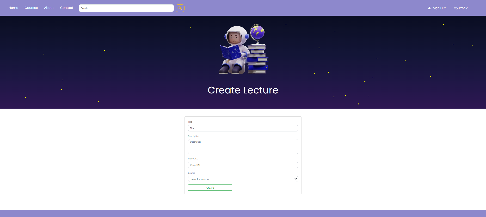

## Assignment Creation
- To create an Assignment navigate to the "Profile" menu. Use the "Add Assignment" menu. The teacher must then add a Title, Content, select the specific lecture that they want to give the assignment to from the drop down menu, and pick the option to enter a link to the document or upload one. 

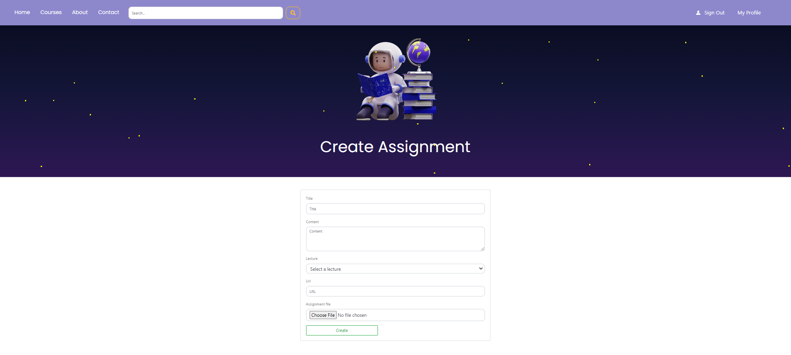

## Administrator 
- To become an “Administrator” of the application you have to be registered by an already existing administrator. Once registered you will gain access to the “Admin Dashboard” upon signing in, where you will have information about every user, course, lecture and assignment and the ability to remove them. 

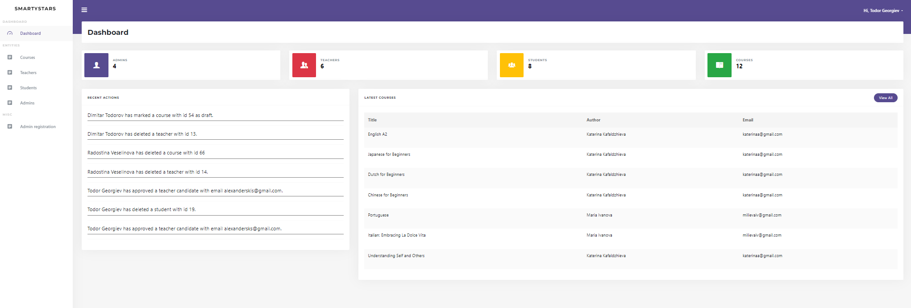

## 
- You can find us at the “Contact” menu, which integrates google maps, just in case you need it.

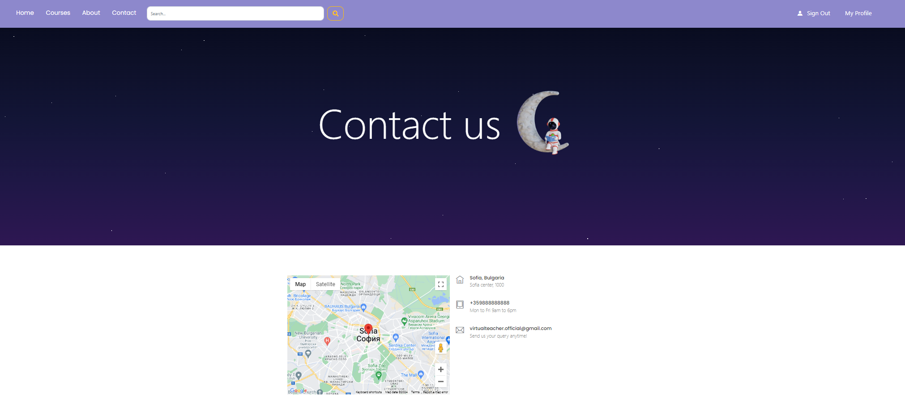

## Technological Highlights
The Virtual Teacher Application leverages the following technologies:
 - Google Cloud SQL & Storage: For storing the database and uploading files.
 - C#: For server-side programming.
 - REST API: For building a manageable REST-ful project.
 - Entity Framework Core: For database operations.
 - HTML/CSS/JavaScript/Ajax: For client-side development and styling.
 - ASP.NET Core MVC: For building the web application.
 - Razor Pages: For creating dynamic web pages.
 - Bootstrap: For responsive and mobile-first design
 - JWT Authentication: Used to access the REST API
 - Password Encryption: Using hashing algorithm for user safety
 - External API Implementation: For searching in Wikipedia in application
 - Unit Testing using Moq Framework

 ## Database Diagram
 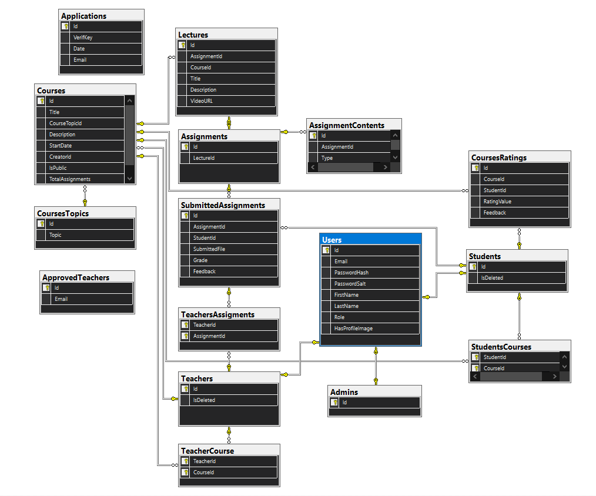

 ## Contributers 
 Contributions are always welcome!

If you have any ideas please create an Issue in the Issues tab above and tag it with the coresponding tag.

## Credits to External Resources
[Site Theme](https://themewagon.github.io/edumark/)

